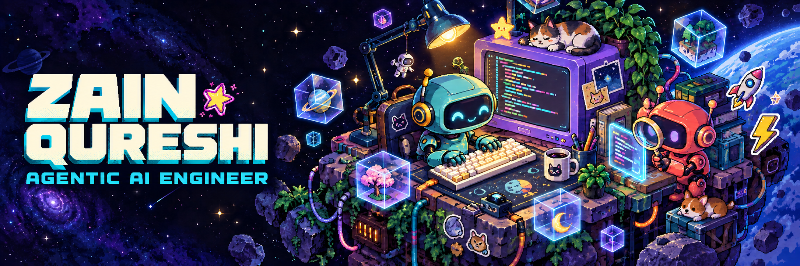
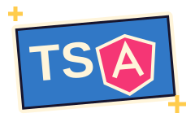
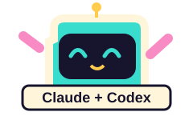

  

  

  
  
  

  
  
  

## Hey, I'm Zain 👋

**Agentic AI engineer. Frontend roots. Engineering since 2019.**

Mostly Angular and TypeScript, at the scale where a mistake costs somebody money. Agentic AI came later and sits on top of that experience. Anyone can prompt a model. Knowing which generated code is brittle before it runs is the part that came from the years before the models existed.

## 🧰 The toolbox

  

<table>
<tr><th>Where</th><th>What I build with</th></tr>
<tr><td><strong>🎨 Product</strong></td><td>        </td></tr>
<tr><td><strong>🤖 Agents</strong></td><td>     </td></tr>
<tr><td><strong>🔎 Checks</strong></td><td>    </td></tr>
<tr><td><strong>⚙️ Services</strong></td><td>  </td></tr>
<tr><td><strong>🗃️ Data</strong></td><td>    </td></tr>
</table>

<strong>🎮 Open the toolbox: what those tools are doing</strong>

- **Product engineering:** interfaces that hold up under real traffic, real money and five years of other people's commits.
- **Agent systems:** multi-agent workflows that do the work and stop where a human has to decide.
- **Verification and runtime:** Playwright, Chrome DevTools Protocol (CDP), deterministic hooks, tracing and circuit breakers. Proving the thing works, and catching it when it does not.
- **Services and data:** enough backend to own a feature end to end instead of handing it over half built.

## ⚡ The experience underneath

| Where it got real | The work |
| :--- | :--- |
| ☁️ **Broadcom CloudSOC** | Frontend for a cloud access security broker, alongside the US team. |
| 🅰️ **Angular 9 → 21** | Three companies. Six years of migrations. |
| 💳 **Card + ACH payments** | Payment surfaces and deposit verification, where the bug report is a chargeback. |

## 🤖 Two agents. Neither taken at its word.

  
  
  

Claude and Codex as a pair, one planning and one building. Copilot as the gate before a push. Guardrails, tracing and recovery around all of it, because an agent that fails silently is worse than one that fails.

> [!TIP]
> Humans name the barrier. AI fills the implementation below it.

<strong>🕹️ The build loop</strong>

1. **Name the barrier.**
2. **Agents implement below it.**
3. **Verify before believing.**
4. **Ship something that runs without me.**

  

## 🐍 The contribution arcade

<picture>
  <source media="(prefers-color-scheme: dark)" srcset="assets/snake-dark.svg">
  
</picture>

<strong>🌃 A year of building, in 3D</strong>

<picture>
  <source media="(prefers-color-scheme: dark)" srcset="assets/calendar-dark.svg">
  
</picture>

<strong>📊 Under the hood: activity metrics</strong>

  <a href="https://linkedin.com/in/zainnqureshii">LinkedIn</a> · <a href="https://www.upwork.com/freelancers/zainnqureshii">Upwork</a>

Visual credits

Original workstation illustration made for this profile with OpenAI image generation. Original animated stickers and divider. Badges by [Shields.io](https://shields.io), icons by [Skill Icons](https://github.com/tandpfun/skill-icons), typing by [Readme Typing SVG](https://github.com/DenverCoder1/readme-typing-svg), views by [Komarev](https://github.com/antonkomarev/github-profile-views-counter). Coding GIF from [Cool GIFs for GitHub](https://github.com/Anmol-Baranwal/Cool-GIFs-For-GitHub). Contribution visuals by [snk](https://github.com/Platane/snk), [GitHub Profile 3D Contrib](https://github.com/yoshi389111/github-profile-3d-contrib) and [Metrics](https://github.com/lowlighter/metrics).

